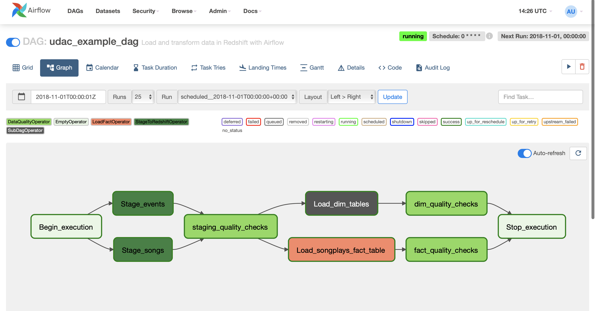
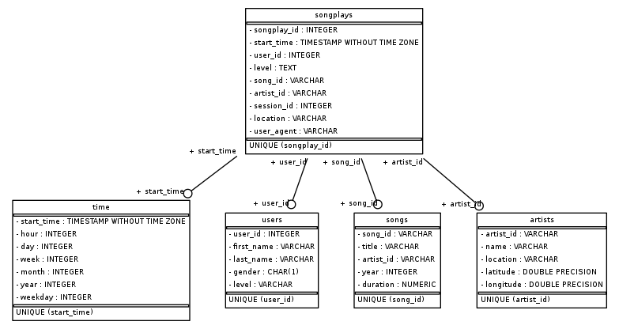

# Project: Data Pipelines
## Introduction

A music streaming company, Sparkify, has decided that it is time to introduce more automation and monitoring to their data warehouse ETL pipelines and come to the conclusion that the best tool to achieve this is Apache Airflow.

They expect you to create high grade data pipelines that are dynamic and built from reusable tasks, can be monitored, and allow easy backfills. They have also noted that the data quality plays a big part when analyses are executed on top the data warehouse and want to run tests against their datasets after the ETL steps have been executed to catch any discrepancies in the datasets.

The source data resides in S3 and needs to be processed in Sparkify's data warehouse in Amazon Redshift. The source datasets consist of JSON logs that tell about user activity in the application and JSON metadata about the songs the users listen to.



***

### Song Dataset

The first dataset is a subset of real data from the Million Song Dataset. Each file is in JSON format and contains metadata about a song and the artist of that song. The files are partitioned by the first three letters of each song's track ID. For example, here are file paths to two files in this dataset.

```song_data/A/B/C/TRABCEI128F424C983.json```
```song_data/A/A/B/TRAABJL12903CDCF1A.json```

And below is an example of what a single song file, TRAABJL12903CDCF1A.json, looks like.

```{"num_songs": 1, "artist_id": "ARJIE2Y1187B994AB7", "artist_latitude": null, "artist_longitude": null, "artist_location": "", "artist_name": "Line Renaud", "song_id": "SOUPIRU12A6D4FA1E1", "title": "Der Kleine Dompfaff", "duration": 152.92036, "year": 0}```

### Log Dataset

The second dataset consists of log files in JSON format generated by this event simulator based on the songs in the dataset above. These simulate activity logs from a music streaming app based on specified configurations.
The log files in the dataset you'll be working with are partitioned by year and month. For example, here are filepaths to two files in this dataset.
```log_data/2018/11/2018-11-12-events.json```
```log_data/2018/11/2018-11-13-events.json```

***

# Schema for Song Play Analysis

Using the song and log datasets, you'll need to create a star schema optimized for queries on song play analysis. This includes the following tables.

### Fact Table

- 1. songplays - records in log data associated with song plays i.e. records with page NextSong
  • songplay_id, start_time, user_id, level, song_id, artist_id, session_id, location, user_agent
  
### Dimension Tables

- 2. users - users in the app
  • user_id, first_name, last_name, gender, level
- 3. songs - songs in music database
  • song_id, title, artist_id, year, duration
- 4. artists - artists in music database
  • artist_id, name, location, latitude, longitude
- 5. time - timestamps of records in songplays broken down into specific units
  • start_time, hour, day, week, month, year, weekday

<!-- width="21px"   (https://www.linkedin.com/in/nagy99/) -->


***

## Prerequisites:
- Create an IAM User in AWS.
- Create a redshift cluster in AWS.
 Ensure that you are creating this cluster in the us-west-2 region. This is important as the s3-bucket that we are going to use for this project is in us-west-2.

***

## Setting up Connections
- Connect Airflow and AWS
- Connect Airflow to the AWS Redshift Cluster

***

